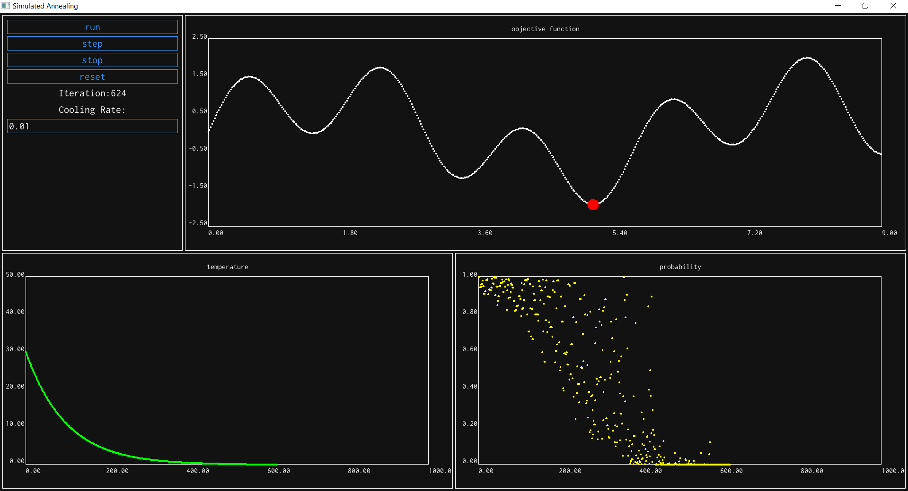

# Simulated Annealing algorithm simulator
## Works on windows only
## Dependencies
- Available inside the repositry
- [SDL2](https://www.libsdl.org/download-2.0.php) - window, input and rendering
- [stb_trutype](https://github.com/nothings/stb/blob/master/stb_truetype.h) - font loading, rasterization and rendering

## Build and run
- Require cl (Microsoft Visual C/C++ compiler) to be in the path.
- To build and run the cmd in a windows terminal
    ```
    cd SimulatedAnneal
    build.bat
    run.bat
    ```
- Compiled binaries are available in "SimulatedAnneal\bin" folder

## Simulator

